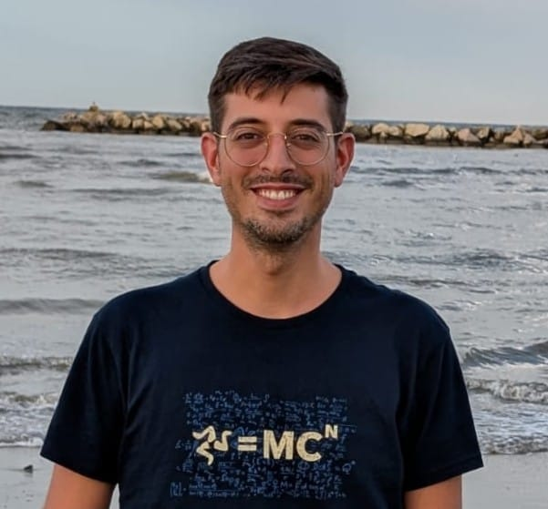

Hi, I'm Giovanni Saraceno. I graduated in Mathematics from the University of Trento and obtained my PhD in Statistics from the University of Trento in June 2021. I spent two years as Postdoctoral Research Associate at the University at Buffalo, New York, USA and from October 2024 I am a fixed-term Assistant Professor (Ricercatore a tempo determinato di tipo A) at the Department of Statistical Sciences at University of Padova, Italia.

My principal area of research are robust statistics, directional statistics, kernel-based methods, neural networks, neuroscience applications.

## Contacts

[Department of Statistical Sciences, University of Padova](https://www.stat.unipd.it/) \
Via Cesare Battisti, 241 - 35121 Padova \
Office: 156

- [@GitHub](https://github.com/giovsaraceno)
- [@Orcid](https://orcid.org/0000-0002-1753-2367)
- [@ResearchGate](https://www.researchgate.net/profile/Giovanni-Saraceno)
- [@GoogleScholar](https://scholar.google.com/citations?user=oYse7v4AAAAJ)
